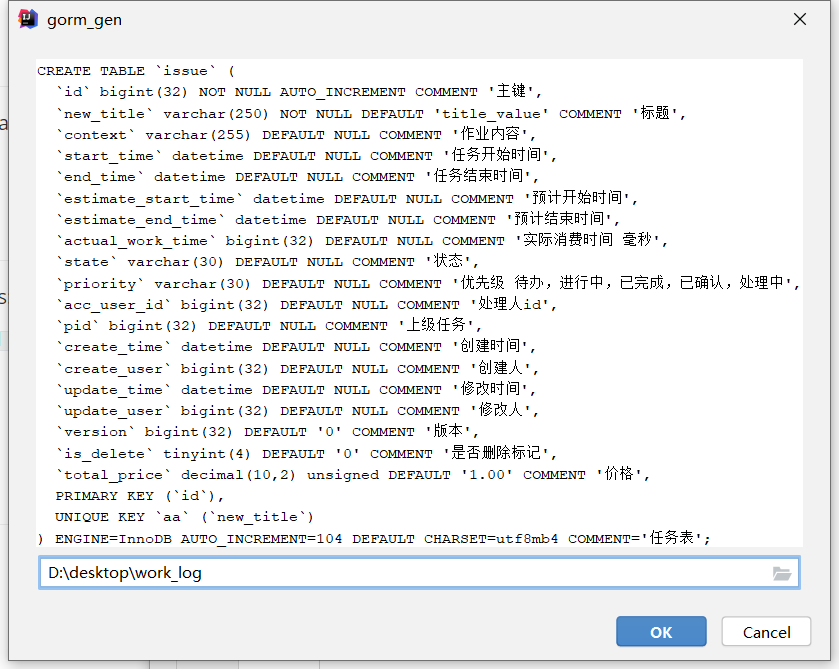

# Gorm Plugin

This plugin helps you to generate specific template code by create table sql 

## Install 
- Using IDE built-in plugin system on Windows:
    - <kbd>File</kbd> > <kbd>Settings</kbd> > <kbd>Plugins</kbd> >  `Install Plugin from Disk...`  

## Usage

- <KBD>Help</KBD> > <KBD>gorm-generator</KBD>

- enter create table sql and output file path 

## Contributions

- [HuiFer](http://github.com/huifer/)

## License
- [Apache 2.0](/LICENSE)